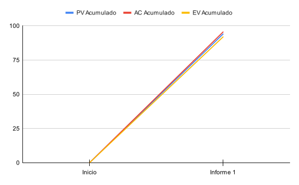
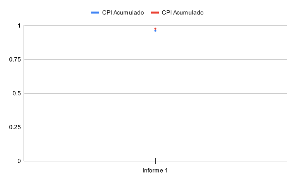

# 1. Datos del documento

# 1.1. Nombre del estudiante

Ignacio Vargas Campos

## 1.2. Fecha y número del informe

- Fecha: 13 de setiembre 2024
- Número: Informe de avance \#1

## 1.3. Centro de investigación o empresa donde se desarrolla el proyecto

El proyecto se está llevando a cabo como parte de un proyecto de investigación
en el Instituto Tecnológico de Costa Rica.

# 2. Actividades realizadas en el periodo reportado

En esta primer mitad de proyecto se ha trabajado en su mayor parte en
actividades de planeación, diseño y preparamiento del proyecto, junto a un poco
de implementación.

Al inicio del proyecto, mi enfoque estuvo en experimentar y familiarizarme con
el API gráfico `wgpu`, ya que WebGPU y `wgpu` son tecnologías emergentes no hay
mucho material de aprendizaje todavía. Inicié con el tutorial [Learn
WGPU](https://sotrh.github.io/learn-wgpu/#what-is-wgpu), el cual no fue
satisfactorio ya que a pesar de dar unas bases sobre las cuales construir un
proyecto no daba la información de fondo que es necesaria para este tipo de
proyecto de investigación. Eventualmente encontré el libro de
[webgpufundamentals](https://webgpufundamentals.org/webgpu/lessons/webgpu-fundamentals.html)
el cual da una introducción con mayor explicación del tema.

Luego, ya con un poco de familiaridad con APIs gráficos, definí los requisitos
del software a desarrollar, de manera que se delimitó el alcance del proyecto
de manera bien definida y verificable.

Después de esto volví a experimentar con `wgpu`, a trabajar en implementar una
estructura muy básica para mi biblioteca de microbenchmarks y crear una prueba
mínima que la utilizara y funcionara correctamente. Esta actividad probó tomar
mucho más tiempo del planeado ya que a pesar de mi familiarización previa con
los conceptos de `wgpu` y WebGPU me di cuenta que igual me faltaba demasiado
contexto y entendimiento de los conceptos básicos de los APIs gráficos. Lograr
llegar a esta estructura mínima me tomó casi el doble de horas estimadas lo
cual la extendió a través de varias semanas, dado que ya estaba estimada para
ser de las actividades individuales más largas.

Mientras llevaba a cabo ese ejemplo mínimo también tuve que realizar el plan de
proyecto. Al realizar el cronograma como parte del plan del proyecto determiné
que el alcance definido en los requerimientos era demasiado ambicioso y se
eliminaron los requerimientos que tenían que ver con ejecución de
microbenchmarks custom dentro de la página web y con la herramienta CLI.

En la tercera semana de estar trabajando en el ejemplo mínimo de biblioteca de
microbenchmarks y un microbenchmark básico, al fin logré estos objetivos.
Seguidamente diseñé la API y estructura de la biblioteca para microbenchmarks
basado en lo que ya sabía de ejecutar un microbenchmark y características que
sería agradable tener en el producto final. Algo bueno de haber durado tanto
realizando el ejemplo mínimo es que tuve mucho tiempo para familiarizarme con
la tecnología y los conceptos de microbenchmark entonces ya tenía los conceptos
del diseño mucho más claros que al inicio.

En esa misma semana tenía en el cronograma diseñar la interfaz web y la
arquitectura del servidor web pero no me alcanzó el tiempo debido a mis atrasos
con el ejemplo básico de microbenchmark.

En la siguiente semana principalmente gasté mi tiempo en crear el documento de
requisitos formal tomando en cuenta todo el diseño que ya tenía definido hasta
el momento y adicionalmente logré implementar el diseño actualizado de la
biblioteca de microbenchmarks.

Finalmente, en esta última semana al fin se agregó una prueba de ancho de banda
de memoria, una actividad que se había programado para hace unas semanas pero
que tampoco había podido realizar debido a que me atrasé con el ejemplo mínimo
de microbenchmark computacional. Algo bueno es que debido a mi experiencia
incrementada y ya tener la biblioteca de microbenchmarks más desarrollada, esta
actividad la realicé en menos de la mitad del tiempo programado. También se
inició con el proceso de reescribir los microbenchmarks existentes como una
biblioteca separada ya que se vio oportuno hacerlo de una vez a pesar de ser
una actividad programada para la próxima semana; eso sí, no se ha concluido,
falta mover el microbenchmark de bando de ancha. Estas últimas actividades
mencionadas realmente fueron como un "extra" de tiempo que le dediqué al
proyecto, ya que la mayoría del tiempo fue utilizado en crear la plantilla para
este informe y redactar este informe mismo, actividades que había fallado en
tomar en cuenta en mi plan de proyecto original ya que no corresponden con
ninguno de los entregables que definí que le agregan valor al proyecto y
avanzan los objetivos específicos de este, estas actividades tendrán que ser
agregadas. Por lo tanto se definió un objetivo adicional solo para acomodar los
entregables de los informes y poder agregar las actividades relacionadas a
redactar informes de avance en el cronograma.

El estado actual del proyecto es en general que está levemente atrasado,
notablemente falta el diseño de la interfaz web y de la arquitectura del
servidor que la sirve.

# 3. Dificultades encontradas

### Falta de material de aprendizaje sobre WebGPU y wgpu

Al ser tecnologías emergentes falta material didáctico y de referencia. Se
solucionó gracias a que encontré
[webgpufundamentals](https://webgpufundamentals.org/webgpu/lessons/webgpu-fundamentals.html).

### Subestimación del tiempo para implementar un ejemplo mínimo de
microbenchmark

La familiarización inicial con wgpu y la implementación de la estructura mínima
tomaron casi el doble de tiempo estimado debido a la falta de comprensión
profunda de los conceptos gráficos básicos. Se resolvió porque al fin se logró
y a pesar de que causó retrasos estoy encaminado para ponerme al día en la
próximas 1 o 2 semanas.

### Falta de planificación para redactar informes

La creación del informe de avance no estaba planificada en el cronograma
original, lo que llevó a la necesidad de dedicar tiempo a actividades no
contempladas que no contribuyen directamente a los objetivos específicos del
proyecto. Se resolvió agregando un objetivo específico para justificar los
entregables de los informes y agregar las actividades de redactarlos al
cronograma.

# 4. Cambios en el alcance y/o actividades

## Actividades agregadas

Las siguientes actividades fueron agregadas como parte de tomar en cuenta a
redacción de informes de avance en el cronograma:

- Creación de plantilla para informes
- Redacción de informe de avance 1
- Redacción de informe de avance 2
- Redacción de informe de avance 3
- Redacción de informe de avance 4
- Redacción de informe de avance final

Las siguientes actividades se decidieron agregar después de conversar y buscar
retroalimentación con la comunidad open source del proyecto Vello, los cuales
eran de los principales interesados en el poryecto desde su conceptualización.

- Experimentar con el efecto de la frecuencia del GPU en los microbenchmarks.
- Agregar la capacidad de fácilmente variar el tamaño de _workgroup_ en los
microbenchmarks.

Todas estas nuevas actividades causan que se sobrepase el "presupuesto" de 10
horas por semana en el cronograma, ya que no se reducirá el alcance del
proyecto para compensar. Esto es una carga que estoy dispuesto a asumir para
asegurar el éxito del proyecto sin tener que reducir su alcance. Además, es
posible que la experimentación con el efecto de la frecuencia del GPU en los
microbenchmarks resulte en actividades adicionales ya que es una actividad de
índole exploratoria e investigativa.

\clearpage

## Cronograma actualizado

| Semana | Actividades a realizar | Horas estimadas de trabajo por semana |
| ------ | ---------------------- | ------------------------------------- |
| 1      | 100                    | 10                                    |
| 2      | 200                    | 10                                    |
| 3      | 300                    | 15                                    |
| 4      | 400                    | 8                                     |
| 5      | 500                    | 8                                     |
| 6      | 600, 601, 602          | 11                                    |
| 7      | 700                    | 8                                     |
| 8      | 800, 801, 802          | 24                                    |
| 9      | 900, 901, 902, 903     | 26                                    |
| 10     | 1000, 1001, 1002       | 14                                    |
| 11     | 1100, 1101, 1102       | 12                                    |
| 12     | 1200, 1201, 1202       | 14                                    |
| 13     | 1300, 1301             | 10                                    |
| 14     | 1400, 1401, 1402       | 14                                    |
| 15     | 1500, 1501             | 12                                    |
| 16     | 1600, 1601             | 14                                    |

\blscape

# 5. Análisis de valor ganado

| ID  | Actividad                                                     | Presupuesto (horas) | % Valor Planeado | PV (horas) | AC (horas) | % trabajo Completado | EV (horas) | CPI (horas) | SPI (horas) | Fecha inicio planeada | Finalización planeada | Fecha inicio real | Finalización real |
| --- | ------------------------------------------------------------- | ------------------- | ---------------- | ---------- | ---------- | -------------------- | ---------- | ----------- | ----------- | --------------------- | --------------------- | ----------------- | ----------------- |
| 100 | Experimentar y familiarizar con wgpu                                                                                                                                                | 10                  | 100%             | 10         | 8:30       | 100%                 | 10         | 1.18        | 1           | 7/22/2024             | 7/26/2024             | 7/22/2024         | 7/26/2024         |
| 200 | Definir requisitos                                                                                                                                                                  | 10                  | 100%             | 10         | 10:00      | 100%                 | 10         | 1.00        | 1           | 7/29/2024             | 8/2/2024              | 7/31/2024         | 8/2/2024          |
| 300 | Crear setup inicial para pruebas con pipeline mínimo y una prueba de multiplicación matricial                                                                                       | 15                  | 100%             | 15         | 25:30      | 100%                 | 15         | 0.59        | 1           | 8/5/2024              | 8/9/2024              | 8/5/2024          | 8/27/2024         |
| 400 | Agregar una prueba de ancho de banda de memoria (la de copias entre buffers) para ya tener una prueba de los 2 tipos principales que hay y tener una mejor idea de qué es necesario | 8                   | 100%             | 8          | 3:00       | 100%                 | 8          | 2.67        | 1           | 8/12/2024             | 8/16/2024             | 9/9/2024          | 9/9/2024          |
| 500 | Plan de proyecto                                                                                                                                                                    | 8                   | 100%             | 8          | 11:00      | 100%                 | 8          | 0.73        | 1           | 8/19/2024             | 8/23/2024             | 8/21/2024         | 8/23/2024         |
| 600 | Diseñar API y arquitectura de biblioteca de framework para crear microbenchmarks                                                                                                    | 5                   | 100%             | 5          | 4:00       | 100%                 | 5          | 1.25        | 1           | 8/26/2024             | 8/28/2024             | 8/27/2024         | 8/28/2024         |
| 601 | Diseñar estructura de página web                                                                                                                                                    | 2                   | 100%             | 2          | 0:30       | 15%                  | 0.3        | 0.60        | 0.15        | 8/28/2024             | 8/28/2024             | 8/6/2024          |                   |
| 602 | Diseñar arquitectura de servidor que sirve página web y comunica con base de datos                                                                                                  | 4                   | 100%             | 4          | 3:00       | 30%                  | 1.2        | 0.40        | 0.3         | 8/29/2024             | 8/30/2024             | 8/6/2024          |                   |
| 700 | Redactar el documento de diseño formal                                                                                                                                              | 8                   | 100%             | 8          | 9:30       | 100%                 | 8          | 0.84        | 1           | 9/2/2024              | 9/6/2024              | 9/3/2024          | 9/6/2024          |
| 800 | Implementar API y arquitectura de biblioteca, reescribiendo las pruebas existentes para adaptarse a la biblioteca ya definida                                                       | 12                  | 100%             | 12         | 3:00       | 100%                 | 12         | 4.00        | 1           | 9/9/2024              | 9/12/2024             | 9/2/2024          | 9/2/2024          |
| 801 | Crear plantilla para informes de avance                                                                                                                                             | 8                   | 100%             | 8          | 8:00       | 100%                 | 8          | 1.00        | 1           | 9/10/2024             | 9/13/2024             | 9/10/2024         | 9/12/2024         |
| 802 | Redactar informe de avance 1                                                                                                                                                        | 4                   | 100%             | 4          | 6:00       | 100%                 | 4          | 0.67        | 1           | 9/13/2024             | 9/13/2024             | 9/13/2024         | 9/13/2024         |
| 900 | Escribir microbenchmarks existentes como una biblioteca separada                                                                                                                    | 4                   | 0%               | 0          | 3:30       | 60%                  | 2.4        | 0.69        | 0           | 9/19/2024             | 9/19/2024             | 9/9/2024          |                   |
|     | **Totales**                                                                                                                                                                             |                     | 44.76%           | 94         | 95:30      | 43.76%               | 91.9       | 0.96        | 0.98        |                       |                       |                   |                   |

\elscape

# 6. Lecciones Aprendidas

- **Separar más las tareas grandes:** Si se fuese a asignar una tarea que se estima dura más de 10 horas, debe separarse en tareas más pequeñas para así poder estimar los tiempos de las tareas pequeñas más facilmente y obtener un estimado más realista para la tarea grande.
- **Incluir tiempo para la documentación y redacción de informes:** Asegurarse de planificar actividades no técnicas como la redacción de informes y creación de plantillas, ya que estas también consumen tiempo y son esenciales para el seguimiento del proyecto.
- **Solicitar retroalimentación temprana y continua:** Buscar comentarios de la comunidad o interesados clave desde las primeras fases del proyecto para ajustar el enfoque y descubrir oportunidades para mejorar lo antes posible.
