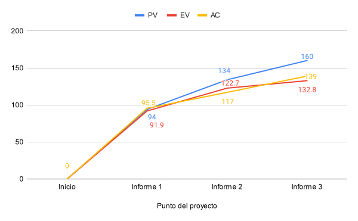

# 1. Datos del documento

## 1.1. Nombre del estudiante

Ignacio Vargas Campos

## 1.2. Fecha y número del informe

- Fecha: 11 de octubre 2024
- Número: Informe de avance \#3

## 1.3. Centro de investigación o empresa donde se desarrolla el proyecto

El proyecto se está llevando a cabo como parte de un proyecto de investigación
en el Instituto Tecnológico de Costa Rica.

# 2. Actividades realizadas en el periodo reportado

En estas 2 semanas pasadas del proyecto no han sido tan provechosas en el
avance de las tareas, esto ya que principalmente me he tenido que devolver a
corregir ciertas características de las bibliotecas que creí ya haber
finalizado y por estarme familiarizando con nuevas tecnologías.

Concretamente, primero se identificó en la [especificación de
WebGPU](https://www.w3.org/TR/webgpu/#timestamp) que el resultado de un
timestamp (mecanismo utilizado para medir los tiempos de ejecución en el GPU)
puede aleatoriamente dar resultados basura que no se pueden utilizar. Por lo
tanto, se tuvo que cambiar el mecanismo que utiliza la biblioteca principal
uwgpu para ejecutar microbenchmarks. Ahora en vez de ejecutar el microbenchmark
todas las veces que el usuario pide en un solo "compute pass" y medir ese
tiempo de ejecución, se ejecutan muchos "compute passes" pequeños y se suma el
tiempo de ejecución de todos ellos; gracias a medir el tiempo con muchos
timestamps podemos descartar cualquier valor de tiempo que no tenga sentido sin
preocuparnos por perder la medición del microbenchmark completamente.

Segundo, al estar desarrollando el servidor que sirve la página web, al fin se
pudo probar la biblioteca de microbenchmark en WASM en un navegador. Pero, al
intentar compilarla para WASM inicialmente salieron muchos errores de
incompatibilidad. Esto se debe a que no cualquier código puede compilarse para WASM y exponerse con interfaces a JavaScript. Por lo tanto se dedicó una
cantidad considerable de tiempo a adaptar las bibliotecas para ser compatibles
con ser compiladas a WASM.

Tercero, definir el esquema de la base de datos de una manera que sea modificable
a futuro, que pueda desplegar a mi servidor privado, e interactuar con ella desde
Rust fueron retos técnicos nuevos para mí, por lo cual el desarrollo del servidor
en general me ha tomado considerablemente más tiempo del planeado.

Finalmente, aparte de esas tareas retadoras, también se pudo avanzar de manera
regular con algunas otras tareas como diseñar la estructura de la interfaz web
e implementar estas páginas en el servidor.

# 3. Dificultades encontradas

### Soporte de bibliotecas con WASM

Fue un reto lograr que las bibliotecas escritas fueran compatibles con WASM.
Como era mi primera vez interactuando de forma real y práctica con esta
tecnología hubieron muchos detalles pequeños que no sabía que debía tomar en
cuenta para que mi código fuera compatible.

Ya se logró esta compatibilidad, pero requirió bastante esfuerzo extra e imprevisto que me atrasó bastante en mis tareas.. A futuro cuando se vaya a
integrar una plataforma o tecnología con la que no he trabajado a fondo antes
debería de dedicar actividades a la experimentación / familiarización /
resolver errores.

### Complejidades inesperdas con el servidor

Implementar el servidor ha estado lleno de retos más grandes de lo esperado.
Desde lo ya mencionado con el soporte de WASM de las bibliotecas utilizadas, a
la investigación y diseño de cómo interactuar con una base de datos que va a
correr en un servidor privado y cómo interactuar con ella desde un lenguaje que
no lo había hecho antes, hasta la creación del HTML y CSS para las páginas ha
sido más retador de lo esperado.

A futuro se intentará identificar tareas que están compuestas por sub-tareas que sean lo suficientemente complejas y que se deberán separar para obtener una estimación de tiempo más realista.

# 4. Cambios en el alcance y/o actividades

No han habido cambios en el alcance ni en las actividades del proyecto.

# 5. Análisis de valor ganado

En la siguiente página se presenta la tabla de valor ganado.

De esta se puede analizar que se ha empeorado el atraso (SPI=0.83) y ha
empeorado también la eficiencia (CPI=0.83). Esto se ha dado ya que a como se
explicó en secciones anteriores, se ha "perdido" mucho tiempo en retos
inesperados en las tareas ya definidas o ya creídas completadas previamente.
Nótese que por 'perdido' no me refiero a que se haya desperdiciado, sino que es
como si hubiera dedicado mucho tiempo sin avanzar en tareas, ya que estos retos
no se previnieron en las tareas definidas.

En la figura \ref{fig:pv} se presenta el avance de las métricas de valor
planeado (PV), trabajo realizado (AC) y valor ganado (EV). Se observa que el
valor ganado ahora tiene más diferencia con el valor planeado, por las razones
ya mencionadas. En la figura \ref{fig:cpi} se presenta el avance en las
métricas de CPI y SPI desde el informe pasado y como ya fue mencionado se
observa que el atraso y la ineficiencia en las tareas ha aumentado.

\blscape

| ID   | Actividad                                                    | Presupuesto (horas) | % Valor Planeado | PV (horas) | AC (horas) | % trabajo Completado | EV (horas) | CPI (horas) | SPI (horas) | Fecha inicio planeada | Finalización planeada | Fecha inicio real | Finalización real |
| ---- | ------------------------------------------------------------ | ------------------- | ---------------- | ---------- | ---------- | -------------------- | ---------- | ----------- | ----------- | --------------------- | --------------------- | ----------------- | ----------------- |
| 100  | Experimentar y familiarizar con wgpu                                                                                                                                                | 10                  | 100%             | 10         | 8:30       | 100%                 | 10         | 1.18        | 1           | 7/22/2024             | 7/26/2024             | 7/22/2024         | 7/26/2024         |
| 200  | Definir requisitos                                                                                                                                                                  | 10                  | 100%             | 10         | 10:00      | 100%                 | 10         | 1.00        | 1           | 7/29/2024             | 8/2/2024              | 7/31/2024         | 8/2/2024          |
| 300  | Crear setup inicial para pruebas con pipeline mínimo y una prueba de multiplicación matricial                                                                                       | 15                  | 100%             | 15         | 25:30      | 100%                 | 15         | 0.59        | 1           | 8/5/2024              | 8/9/2024              | 8/5/2024          | 8/27/2024         |
| 400  | Agregar una prueba de ancho de banda de memoria (la de copias entre buffers) para ya tener una prueba de los 2 tipos principales que hay y tener una mejor idea de qué es necesario | 8                   | 100%             | 8          | 3:00       | 100%                 | 8          | 2.67        | 1           | 8/12/2024             | 8/16/2024             | 9/9/2024          | 9/9/2024          |
| 500  | Plan de proyecto                                                                                                                                                                    | 8                   | 100%             | 8          | 11:00      | 100%                 | 8          | 0.73        | 1           | 8/19/2024             | 8/23/2024             | 8/21/2024         | 8/23/2024         |
| 600  | Diseñar API y arquitectura de biblioteca de framework para crear microbenchmarks                                                                                                    | 5                   | 100%             | 5          | 4:00       | 100%                 | 5          | 1.25        | 1           | 8/26/2024             | 8/28/2024             | 8/27/2024         | 8/28/2024         |
| 601  | Diseñar estructura de página web                                                                                                                                                    | 2                   | 100%             | 2          | 2:30       | 100%                 | 2          | 0.80        | 1           | 8/28/2024             | 8/28/2024             | 8/6/2024          | 10/10/2024        |
| 602  | Diseñar arquitectura de servidor que sirve página web y comunica con base de datos                                                                                                  | 4                   | 100%             | 4          | 5:00       | 80%                  | 3.2        | 0.64        | 0.8         | 8/29/2024             | 8/30/2024             | 8/6/2024          | 10/10/2024        |
| 700  | Redactar el documento de diseño formal                                                                                                                                              | 8                   | 100%             | 8          | 9:30       | 100%                 | 8          | 0.84        | 1           | 9/2/2024              | 9/6/2024              | 9/3/2024          | 9/6/2024          |
| 800  | Implementar API y arquitectura de biblioteca, reescribiendo las pruebas existentes para adaptarse a la biblioteca ya definida                                                       | 12                  | 100%             | 12         | 6:00       | 100%                 | 12         | 2.00        | 1           | 9/9/2024              | 9/12/2024             | 9/2/2024          | 9/2/2024          |
| 801  | Crear plantilla para informes de avance                                                                                                                                             | 8                   | 100%             | 8          | 8:00       | 100%                 | 8          | 1.00        | 1           | 9/10/2024             | 9/13/2024             | 9/10/2024         | 9/12/2024         |
| 802  | Redactar informe de avance 1                                                                                                                                                        | 4                   | 100%             | 4          | 6:00       | 100%                 | 4          | 0.67        | 1           | 9/13/2024             | 9/13/2024             | 9/13/2024         | 9/13/2024         |
| 900  | Escribir microbenchmarks existentes como una biblioteca separada                                                                                                                    | 4                   | 100%             | 4          | 6:00       | 100%                 | 4          | 0.67        | 1           | 9/19/2024             | 9/19/2024             | 9/9/2024          | 9/18/2024         |
| 901  | Implementar interfaz CLI como wrapper de la biblioteca de microbenchmarks                                                                                                           | 4                   | 100%             | 4          | 4:00       | 100%                 | 4          | 1.00        | 1           | 9/19/2024             | 9/19/2024             | 9/18/2024         | 9/26/2024         |
| 902  | Agregar la capacidad de fácilmente variar el tamaño de workgroup en los microbenchmarks.                                                                                            | 8                   | 100%             | 8          | 6:30       | 100%                 | 8          | 1.23        | 1           | 9/15/2024             | 9/16/2024             | 9/18/2024         | 9/18/2024         |
| 903  | Experimentar con el efecto de la frecuencia del GPU en los microbenchmarks.                                                                                                         | 10                  | 100%             | 10         | 4:00       | 100%                 | 10         | 2.50        | 1           | 9/17/2024             | 9/19/2024             | 9/26/2024         | 9/26/2024         |
| 1000 | Implementar servidor que sirve página web con configuración local                                                                                                                   | 8                   | 100%             | 8          | 15:00      | 70%                  | 5.6        | 0.37        | 0.7         | 9/23/2024             | 9/25/2024             | 9/26/2024         |                   |
| 1001 | Agregar detalles de producción al servidor (como configuración de DB real)                                                                                                          | 2                   | 100%             | 2          |            | 0%                   | 0          | 0.00        | 0           | 9/25/2024             | 9/27/2024             |                   |                   |
| 1002 | Redactar informe de avance 2                                                                                                                                                        | 4                   | 100%             | 4          | 2:30       | 100%                 | 4          | 1.60        | 1           | 9/26/2024             | 9/27/2024             | 9/26/2024         | 9/27/2024         |
| 1100 | Crear el archivo de nix para empaquetar el servidor                                                                                                                                 | 3                   | 100%             | 3          |            | 0%                   | 0          | 0.00        | 0           | 9/30/2024             | 10/1/2024             |                   |                   |
| 1101 | Poner el servidor en el servicio de hosting                                                                                                                                         | 4                   | 100%             | 4          |            | 0%                   | 0          | 0.00        | 0           | 10/1/2024             | 10/2/2024             |                   |                   |
| 1102 | Implementar microbenchmark de reducción                                                                                                                                             | 5                   | 100%             | 5          |            | 0%                   | 0          | 0.00        | 0           | 10/3/2024             | 10/4/2024             |                   |                   |
| 1200 | Implementar microbenchmark de convolución                                                                                                                                           | 5                   | 100%             | 5          |            | 0%                   | 0          | 0.00        | 0           | 10/7/2024             | 10/9/2024             |                   |                   |
| 1201 | Implementar microbenchmark de scan                                                                                                                                                  | 5                   | 100%             | 5          |            | 0%                   | 0          | 0.00        | 0           | 10/9/2024             | 10/11/2024            |                   |                   |
| 1202 | Redactar informe de avance 3                                                                                                                                                        | 4                   | 100%             | 4          | 2:00       | 100%                 | 4          | 2.00        | 1           | 10/11/2024            | 10/11/2024            | 10/11/2024        | 10/11/2024        |
|      | Totales                |    | 76.19% | 160 | 139:00 | 63.24% | 132.8 | 0.96 | 0.83 |           |           |  |  |

\elscape

# 6. Lecciones Aprendidas

- **Asignar actividades para la integración de nuevas tecnologías:** Aprendí
que cuando se utilizan tecnologías o inclusive integraciones de tecnologías
nuevas, pueden haber detalles o complicaciones completamente inesperados
(debido a la falta de conocimiento) que pueden bloquear el avance por
cantidades considerables de tiempo. Por esto, de ahora en adelante, cuando se
deban integrar nuevas tecnologías, se deberán asignar actividades dedicadas
solamente a esta integración, para asegurar que se tome en cuenta cualquier
imprevisto.

- **Evaluar la complejidad de las tareas:** Aprendí que es fundamental evaluar
la complejidad de cada tarea antes de comenzar y pensar más a fondo si se
debería separar en más tareas. En el futuro, dedicaré más tiempo a identificar
si puedo desglosar tareas más complejas en pasos más pequeños y realistas, para
así tener una mejor idea de los tiempos y evitar sorpresas.
