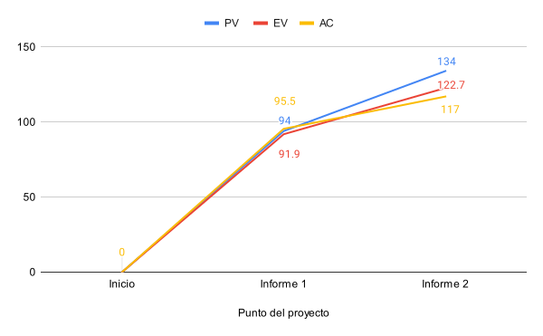
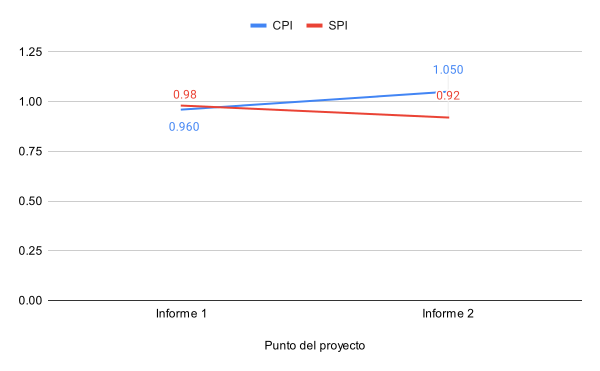

# 1. Datos del documento

## 1.1. Nombre del estudiante

Ignacio Vargas Campos

## 1.2. Fecha y número del informe

- Fecha: 27 de setiembre 2024
- Número: Informe de avance \#2

## 1.3. Centro de investigación o empresa donde se desarrolla el proyecto

El proyecto se está llevando a cabo como parte de un proyecto de investigación
en el Instituto Tecnológico de Costa Rica.

# 2. Actividades realizadas en el periodo reportado

En estas 2 semanas pasadas del proyecto se ha trabajado en su mayor parte en
implementación de microbenchmarks y sus interfaces, a continuación se describen
estas actividades con sus identificadores entre paréntesis.

Primero se le agregó a la biblioteca de microbenchmarks la capacidad de variar
el tamaño de los "workgroups" con los que se ejecutan los microbenchmarks
(902). Luego se finalizó de escribir los microbenchmarks existentes como una
biblioteca separada ya más refinada (900). Se implementó la interfaz CLI para
poder hacer pruebas variadas de estos microbenchmarks más fácilmente (901).

Ya con la interfaz CLI se pudieron hacer experimentos del efecto de la
frecuencia del GPU en los microbenchmarks de manera más sencilla (903). De
estos experimentos se determinó que sí afecta bastante en su rendimiento, pero
que con realizar algunos pases de calentamiento el GPU alcanza su frecuencia
máxima muy rápido y con esto tiene un rendimiento "estándar" para ejecutar y
medir los microbenchmarks. Por lo tanto ya no es una preocupación y no se
explorará más este tema.

Finalmente, todavía se sigue trabajando en el diseño e implementación local del
servidor web (602, 1000). Se inició con el diseño de su arquitectura pero ya en
marcha me bloqueé por no estar tan claro de qué requería el diseño, por lo que
decidí iniciar paralelamente con la implementación.

Todavía no se ha diseñado la estructura de la página web (601), falta finalizar el diseño e implementación del servidor web (602, 1000) así como agregar los detalles de producción al servidor (1001). Se espera hacer un avance significativo en estas actividades a través del fin de semana e iniciar la próxima semana con un atraso nulo o mínimo.

# 3. Dificultades encontradas

### Dificultad en toma de decisiones de diseño

Hay muchas pequeñas decisiones de diseño que tomar, desde cómo se presentan las
interfaces a las bibliotecas, cuánto control se le da al usuario de las
bibliotecas, hasta cómo realizar las implementaciones internas de estas
bibliotecas y herramientas. Tomar todas estas decisiones a veces llega a ser
fatigoso al punto que me empiezo a bloquear en el avance de los diseños por
sentirme abrumado.

De momento lo he resuelto saltando entre tareas de diseño e implementación
cuando me fatigo. También cuando siento que me hace falta criterio para tomar
decisiones de baja consecuencia solo adopto la opción más fácil de implementar
o de cambiar a futuro si fuera necesario.

### Falta de flexibilidad en biblioteca para CLI

Este ha sido el mayor reto técnico a la hora de implementar código. Utilicé la
biblioteca `clap` para crear la interfaz para la línea de comandos. Ya tenía
familiarización previa con ella y es muy buena y simplifica mucho la creación
de comandos. A pesar de esto, necesitaba un comportamiento bastante particular
para una de las opciones que se puede controlar para los microbenchmarks, el
tamaño de "workgroups". El comportamiento necesario para leer estos argumentos
era que se lea un "array" de una cantidad variable de argumentos, dependiendo
del microbenchmark, y que se puedan especificar varios de estos "arrays" y que
el microbenchmark se ejecute varias veces con los diferentes tamaños de
"workgroups".

Se me dificultó entender cómo decirle a la biblioteca que tuviera este
comportamiento particular, pero al final lo logré solucionar y obtuve el
comportamiento deseado.

Posiblemente el problema no es una "falta de flexibilidad" de la biblioteca,
sino una falta de documentación sobre cómo implementar este tipo de caso
particular.

# 4. Cambios en el alcance y/o actividades

No han habido cambios en el alcance ni en las actividades del proyecto.

# 5. Análisis de valor ganado

En la siguiente página se presenta la tabla de valor ganado.

De esta se puede analizar que se mantiene un leve atraso (SPI=0.92), a pesar de
que se ha logrado mantener una buena eficiencia al realizar las actividades
(CPI=1.05). De esto se determina que simplemente me falta aumentar el volumen
de trabajo que le dedico al proyecto para lograr alcanzar los objetivos y
actividades planeadas. Cabe recalcar que parte del atraso es porque se planea
finalizar algunas de las actividades incompletas de esta semana en los próximos
días del fin de semana.

En la figura \ref{fig:pv} se presenta el avance de las métricas de valor
planeado (PV), trabajo realizado (AC) y valor ganado (EV). Se observa que el
valor ganado ahora tiene más diferencia con el valor planeado, por las razones
ya mencionadas. En la figura \ref{fig:cpi} se presenta el avance en las
métricas de CPI y SPI desde el informe pasado y como ya fue mencionado se
observa que la eficiencia en las tareas ha aumentado pero estoy un poco más
atrasado que en el informe pasado.

\blscape

| ID   | Actividad                                                    | Presupuesto (horas) | % Valor Planeado | PV (horas) | AC (horas) | % trabajo Completado | EV (horas) | CPI (horas) | SPI (horas) | Fecha inicio planeada | Finalización planeada | Fecha inicio real | Finalización real |
| ---- | ------------------------------------------------------------ | ------------------- | ---------------- | ---------- | ---------- | -------------------- | ---------- | ----------- | ----------- | --------------------- | --------------------- | ----------------- | ----------------- |
| 100  | Experimentar y familiarizar con wgpu                                                                                                                                                | 10                  | 100%             | 10         | 8:30       | 100%                 | 10         | 1.18        | 1           | 7/22/2024             | 7/26/2024             | 7/22/2024         | 7/26/2024         |
| 200  | Definir requisitos                                                                                                                                                                  | 10                  | 100%             | 10         | 10:00      | 100%                 | 10         | 1.00        | 1           | 7/29/2024             | 8/2/2024              | 7/31/2024         | 8/2/2024          |
| 300  | Crear setup inicial para pruebas con pipeline mínimo y una prueba de multiplicación matricial                                                                                       | 15                  | 100%             | 15         | 25:30      | 100%                 | 15         | 0.59        | 1           | 8/5/2024              | 8/9/2024              | 8/5/2024          | 8/27/2024         |
| 400  | Agregar una prueba de ancho de banda de memoria (la de copias entre buffers) para ya tener una prueba de los 2 tipos principales que hay y tener una mejor idea de qué es necesario | 8                   | 100%             | 8          | 3:00       | 100%                 | 8          | 2.67        | 1           | 8/12/2024             | 8/16/2024             | 9/9/2024          | 9/9/2024          |
| 500  | Plan de proyecto                                                                                                                                                                    | 8                   | 100%             | 8          | 11:00      | 100%                 | 8          | 0.73        | 1           | 8/19/2024             | 8/23/2024             | 8/21/2024         | 8/23/2024         |
| 600  | Diseñar API y arquitectura de biblioteca de framework para crear microbenchmarks                                                                                                    | 5                   | 100%             | 5          | 4:00       | 100%                 | 5          | 1.25        | 1           | 8/26/2024             | 8/28/2024             | 8/27/2024         | 8/28/2024         |
| 601  | Diseñar estructura de página web                                                                                                                                                    | 2                   | 100%             | 2          | 0:30       | 15%                  | 0.3        | 0.60        | 0.15        | 8/28/2024             | 8/28/2024             | 8/6/2024          |                   |
| 602  | Diseñar arquitectura de servidor que sirve página web y comunica con base de datos                                                                                                  | 4                   | 100%             | 4          | 3:00       | 50%                  | 2          | 0.67        | 0.5         | 8/29/2024             | 8/30/2024             | 8/6/2024          |                   |
| 700  | Redactar el documento de diseño formal                                                                                                                                              | 8                   | 100%             | 8          | 9:30       | 100%                 | 8          | 0.84        | 1           | 9/2/2024              | 9/6/2024              | 9/3/2024          | 9/6/2024          |
| 800  | Implementar API y arquitectura de biblioteca, reescribiendo las pruebas existentes para adaptarse a la biblioteca ya definida                                                       | 12                  | 100%             | 12         | 3:00       | 100%                 | 12         | 4.00        | 1           | 9/9/2024              | 9/12/2024             | 9/2/2024          | 9/2/2024          |
| 801  | Crear plantilla para informes de avance                                                                                                                                             | 8                   | 100%             | 8          | 8:00       | 100%                 | 8          | 1.00        | 1           | 9/10/2024             | 9/13/2024             | 9/10/2024         | 9/12/2024         |
| 802  | Redactar informe de avance 1                                                                                                                                                        | 4                   | 100%             | 4          | 6:00       | 100%                 | 4          | 0.67        | 1           | 9/13/2024             | 9/13/2024             | 9/13/2024         | 9/13/2024         |
| 900  | Escribir microbenchmarks existentes como una biblioteca separada                                                                                                                    | 4                   | 100%             | 4          | 6:02       | 100%                 | 4          | 0.66        | 1           | 9/19/2024             | 9/19/2024             | 9/9/2024          | 9/18/2024         |
| 901  | Implementar interfaz CLI como wrapper de la biblioteca de microbenchmarks                                                                                                           | 4                   | 100%             | 4          | 4:00       | 100%                 | 4          | 1.00        | 1           | 9/19/2024             | 9/19/2024             | 9/18/2024         | 9/26/2024         |
| 902  | Agregar la capacidad de fácilmente variar el tamaño de workgroup en los microbenchmarks.                                                                                            | 8                   | 100%             | 8          | 6:30       | 100%                 | 8          | 1.23        | 1           | 9/15/2024             | 9/16/2024             | 9/18/2024         | 9/18/2024         |
| 903  | Experimentar con el efecto de la frecuencia del GPU en los microbenchmarks.                                                                                                         | 10                  | 100%             | 10         | 4:00       | 100%                 | 10         | 2.50        | 1           | 9/17/2024             | 9/19/2024             | 9/26/2024         | 9/26/2024         |
| 1000 | Implementar servidor que sirve página web con configuración local                                                                                                                   | 8                   | 100%             | 8          | 2:00       | 30%                  | 2.4        | 1.20        | 0.3         | 9/23/2024             | 9/25/2024             | 9/26/2024         |                   |
| 1001 | Agregar detalles de producción al servidor (como configuración de DB real)                                                                                                          | 2                   | 100%             | 2          |            | 0%                   | 0          | 0.00        | 0           | 9/25/2024             | 9/27/2024             |                   |                   |
| 1002 | Redactar informe de avance 2                                                                                                                                                        | 4                   | 100%             | 4          | 2:30       | 100%                 | 4          | 1.60        | 1           | 9/26/2024             | 9/27/2024             | 9/26/2024         |                   |
|      | **Totales**                                                                                                                                                                         |                     | 63.81%           | 134        | 117:02     | 58.43%               | 122.7      | 1.05        | 0.92        |                       |                       |                   |                   |

\elscape

# 6. Lecciones Aprendidas

- **No sobrepensar las decisiones pequeñas:** El proyecto conlleva muchas
decisiones de diseño que son de bajo impacto, osea que no son críticas para el
éxito del proyecto. Para estas decisiones se aprendió que es mejor no dedicar
demasiado tiempo a su deliberación sino que es mejor avanzar con alguna que sea
fácil de cambiar a futuro o fácil de implementar ahora. Si llega a ser
necesario cambiarla se cambiará a futuro y ya, pero esto permite avanzar más
rápido en las partes que no son tan críticas del proyecto.

- **Tomar descansos estratégicos para evitar bloqueos creativos:** Durante el desarrollo del proyecto, se identificó que el proceso de tomar decisiones de diseño pequeñas puede ser abrumador y llevar a bloqueos. Se aprendió que es útil alternar entre tareas de diseño e implementación para mantener el flujo de trabajo activo y evitar estancamientos. Esta práctica permite descansar de una tarea mentalmente exigente, como el diseño, mientras se avanza en la implementación, lo que resulta en un progreso más constante.
