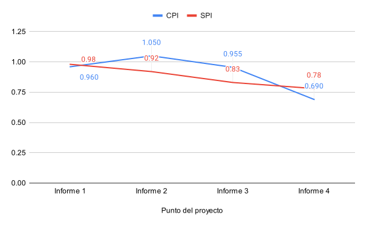

# 1. Datos del documento

## 1.1. Nombre del estudiante

Ignacio Vargas Campos

## 1.2. Fecha y número del informe

- Fecha: 25 de octubre 2024
- Número: Informe de avance \#4

## 1.3. Centro de investigación o empresa donde se desarrolla el proyecto

El proyecto se está llevando a cabo como parte de un proyecto de investigación
en el Instituto Tecnológico de Costa Rica.

# 2. Actividades realizadas en el periodo reportado

Estas 2 últimas semanas, me concentré en terminar de crear el servidor (1000),
también cree el archivo nix para este con sus detalles de producción (1001 y
1100). Ya solo me falta poner el servidor en el servicio de hosting para que
sea accesible (1101).

La implementación del servidor tomó la mayoría del tiempo (1000), se realizó el
"frontend" y el "backend", incluyendo la comunicación entre sí para guardar los
datos de las ejecuciones y para poder obtener estadísticas de los datos
históricos guardados, también se diseñó e implementó la interfaz con la base de
datos.

Adicionalmente, se tuvo que revisitar cortamente la biblioteca para crear microbenchmarks porque se tuvo que arreglar una pulga. Esta pulga pudo ser evitada si hubiera escrito pruebas unitarias.

No se realizaron variaciones con respecto al plan de proyecto, se mantienen las
actividades ya definidas.

# 3. Dificultades encontradas

### Pulga inesperada me hizo perder tiempo

La pulga que describí en la biblioteca para crear microbenchmarks empezó a
crear problemas inesperados que no había notado hasta analizar los resultados
en la página web y notar incongruencias. Me costó determinar el origen del
error pero eventualmente lo pude identificar y arreglar.

### Falta de datos de prueba representativos

Una dificultad que se me ha presentado a la hora de decidir cómo filtrar los
resultados utilizados en las estadísticas históricas, es que no tengo datos
representativos de uso real. Solo tengo los datos de haber ejecutar el servidor
localmente, ejecutando los microbenchmarks en mi propia laptop. Por lo tanto no
estoy seguro cómo se vería la información de sistema operativo, plataforma y
hardware recolectada de otros dispositivos. Por esto, se me dificultó decidir
cómo filtrar los resultados basados en estas características. Este problema se
dio porque la tarea de poner el servidor en el servicio de hosting (1101) aún
no se ha realizado.

# 4. Cambios en el alcance y/o actividades

No han habido cambios en el alcance ni en las actividades del proyecto.

# 5. Análisis de valor ganado

En la siguiente página se presenta la tabla de valor ganado.

De esta se puede analizar que se ha empeorado el atraso (SPI=0.78) y ha
empeorado mucho la eficiencia (CPI=0.69). Esto sucedió por la cantidad
considerable de tiempo que estuve pegado en implementar el servidor. En la
tabla se observa que esa tarea tiene un CPI de 0.11, aludiendo a que la
subestimé severamente.

En la figura \ref{fig:pv} se presenta el avance de las métricas de valor
planeado (PV), trabajo realizado (AC) y valor ganado (EV). Se observa que el
valor ganado ahora tiene más diferencia con el valor planeado, por las razones
ya mencionadas.
Pero se osberva que el trabajo realizado ha aumentado mucho, debido al gran
volumen de trabajo que fue realizar la implementación del servidor.

En la figura \ref{fig:cpi} se presenta el avance en las
métricas de CPI y SPI desde el informe pasado y como ya fue mencionado se
observa que el CPI cayó mucho.

\blscape

| ID   | Actividad                                                    | Presupuesto (horas) | % Valor Planeado | PV (horas) | AC (horas) | % trabajo Completado | EV (horas) | CPI (horas) | SPI (horas) | Fecha inicio planeada | Finalización planeada | Fecha inicio real | Finalización real |
| ---- | ------------------------------------------------------------ | ------------------- | ---------------- | ---------- | ---------- | -------------------- | ---------- | ----------- | ----------- | --------------------- | --------------------- | ----------------- | ----------------- |
| 100  | Experimentar y familiarizar con wgpu                                                                                                                                                | 10                  | 100%             | 10         | 8:30       | 100%                 | 10         | 1.18        | 1           | 7/22/2024             | 7/26/2024             | 7/22/2024         | 7/26/2024         |
| 200  | Definir requisitos                                                                                                                                                                  | 10                  | 100%             | 10         | 10:00      | 100%                 | 10         | 1.00        | 1           | 7/29/2024             | 8/2/2024              | 7/31/2024         | 8/2/2024          |
| 300  | Crear setup inicial para pruebas con pipeline mínimo y una prueba de multiplicación matricial                                                                                       | 15                  | 100%             | 15         | 25:30      | 100%                 | 15         | 0.59        | 1           | 8/5/2024              | 8/9/2024              | 8/5/2024          | 8/27/2024         |
| 400  | Agregar una prueba de ancho de banda de memoria (la de copias entre buffers) para ya tener una prueba de los 2 tipos principales que hay y tener una mejor idea de qué es necesario | 8                   | 100%             | 8          | 3:00       | 100%                 | 8          | 2.67        | 1           | 8/12/2024             | 8/16/2024             | 9/9/2024          | 9/9/2024          |
| 500  | Plan de proyecto                                                                                                                                                                    | 8                   | 100%             | 8          | 11:00      | 100%                 | 8          | 0.73        | 1           | 8/19/2024             | 8/23/2024             | 8/21/2024         | 8/23/2024         |
| 600  | Diseñar API y arquitectura de biblioteca de framework para crear microbenchmarks                                                                                                    | 5                   | 100%             | 5          | 4:00       | 100%                 | 5          | 1.25        | 1           | 8/26/2024             | 8/28/2024             | 8/27/2024         | 8/28/2024         |
| 601  | Diseñar estructura de página web                                                                                                                                                    | 2                   | 100%             | 2          | 2:30       | 100%                 | 2          | 0.80        | 1           | 8/28/2024             | 8/28/2024             | 8/6/2024          | 10/10/2024        |
| 602  | Diseñar arquitectura de servidor que sirve página web y comunica con base de datos                                                                                                  | 4                   | 100%             | 4          | 5:00       | 80%                  | 3.2        | 0.64        | 0.8         | 8/29/2024             | 8/30/2024             | 8/6/2024          | 10/10/2024        |
| 700  | Redactar el documento de diseño formal                                                                                                                                              | 8                   | 100%             | 8          | 9:30       | 100%                 | 8          | 0.84        | 1           | 9/2/2024              | 9/6/2024              | 9/3/2024          | 9/6/2024          |
| 800  | Implementar API y arquitectura de biblioteca, reescribiendo las pruebas existentes para adaptarse a la biblioteca ya definida                                                       | 12                  | 100%             | 12         | 6:00       | 100%                 | 12         | 2.00        | 1           | 9/9/2024              | 9/12/2024             | 9/2/2024          | 9/2/2024          |
| 801  | Crear plantilla para informes de avance                                                                                                                                             | 8                   | 100%             | 8          | 8:00       | 100%                 | 8          | 1.00        | 1           | 9/10/2024             | 9/13/2024             | 9/10/2024         | 9/12/2024         |
| 802  | Redactar informe de avance 1                                                                                                                                                        | 4                   | 100%             | 4          | 6:00       | 100%                 | 4          | 0.67        | 1           | 9/13/2024             | 9/13/2024             | 9/13/2024         | 9/13/2024         |
| 900  | Escribir microbenchmarks existentes como una biblioteca separada                                                                                                                    | 4                   | 100%             | 4          | 6:00       | 100%                 | 4          | 0.67        | 1           | 9/19/2024             | 9/19/2024             | 9/9/2024          | 9/18/2024         |
| 901  | Implementar interfaz CLI como wrapper de la biblioteca de microbenchmarks                                                                                                           | 4                   | 100%             | 4          | 4:00       | 100%                 | 4          | 1.00        | 1           | 9/19/2024             | 9/19/2024             | 9/18/2024         | 9/26/2024         |
| 902  | Agregar la capacidad de fácilmente variar el tamaño de workgroup en los microbenchmarks.                                                                                            | 8                   | 100%             | 8          | 6:30       | 100%                 | 8          | 1.23        | 1           | 9/15/2024             | 9/16/2024             | 9/18/2024         | 9/18/2024         |
| 903  | Experimentar con el efecto de la frecuencia del GPU en los microbenchmarks.                                                                                                         | 10                  | 100%             | 10         | 4:00       | 100%                 | 10         | 2.50        | 1           | 9/17/2024             | 9/19/2024             | 9/26/2024         | 9/26/2024         |
| 1000 | Implementar servidor que sirve página web con configuración local                                                                                                                   | 8                   | 100%             | 8          | 76:00      | 100%                 | 8          | 0.11        | 1           | 9/23/2024             | 9/25/2024             | 9/26/2024         | 10/23/2024        |
| 1001 | Agregar detalles de producción al servidor (como configuración de DB real)                                                                                                          | 2                   | 100%             | 2          | 1:00       | 100%                 | 2          | 2.00        | 1           | 9/25/2024             | 9/27/2024             | 10/24/2024        | 10/24/2024        |
| 1002 | Redactar informe de avance 2                                                                                                                                                        | 4                   | 100%             | 4          | 2:30       | 100%                 | 4          | 1.60        | 1           | 9/26/2024             | 9/27/2024             | 9/26/2024         | 9/27/2024         |
| 1100 | Crear el archivo de nix para empaquetar el servidor                                                                                                                                 | 3                   | 100%             | 3          | 7:00       | 100%                 | 3          | 0.43        | 1           | 9/30/2024             | 10/1/2024             | 10/24/2024        | 10/25/2024        |
| 1101 | Poner el servidor en el servicio de hosting                                                                                                                                         | 4                   | 100%             | 4          |            | 0%                   | 0          | 0.00        | 0           | 10/1/2024             | 10/2/2024             |                   |                   |
| 1102 | Implementar microbenchmark de reducción                                                                                                                                             | 5                   | 100%             | 5          |            | 0%                   | 0          | 0.00        | 0           | 10/3/2024             | 10/4/2024             |                   |                   |
| 1200 | Implementar microbenchmark de convolución                                                                                                                                           | 5                   | 100%             | 5          |            | 0%                   | 0          | 0.00        | 0           | 10/7/2024             | 10/9/2024             |                   |                   |
| 1201 | Implementar microbenchmark de scan                                                                                                                                                  | 5                   | 100%             | 5          |            | 0%                   | 0          | 0.00        | 0           | 10/9/2024             | 10/11/2024            |                   |                   |
| 1202 | Redactar informe de avance 3                                                                                                                                                        | 4                   | 100%             | 4          | 2:00       | 100%                 | 4          | 2.00        | 1           | 10/11/2024            | 10/11/2024            | 10/11/2024        | 10/11/2024        |
| 1300 | Implementar microbenchmark de accesos de memoria secuenciales                                                                                                                       | 5                   | 100%             | 5          |            | 0%                   | 0          | 0.00        | 0           | 10/14/2024            | 10/16/2024            |                   |                   |
| 1301 | Implementar microbenchmark de accesos de memoria desordenados                                                                                                                       | 5                   | 100%             | 5          |            | 0%                   | 0          | 0.00        | 0           | 10/16/2024            | 10/18/2024            |                   |                   |
| 1400 | Implementar microbenchmark de ancho de banda de copiar de buffer->textura                                                                                                           | 5                   | 100%             | 5          |            | 0%                   | 0          | 0.00        | 0           | 10/21/2024            | 10/23/2024            |                   |                   |
| 1401 | Implementar microbenchmark de ancho de banda de copiar entre texturas                                                                                                               | 5                   | 100%             | 5          |            | 0%                   | 0          | 0.00        | 0           | 10/23/2024            | 10/25/2024            |                   |                   |
| 1402 | Redactar informe de avance 4                                                                                                                                                        | 4                   | 100%             | 4          | 2:00       | 100%                 | 4          | 2.00        | 1           | 10/25/2024            | 10/25/2024            | 10/25/2024        | 10/25/2024        |
|      | Totales                                                                                                                                                                             |                     | 87.62%           | 184        | 210:00     | 68.67%               | 144.2      | 0.69        | 0.78        |                       |                       |                   |                   |

\elscape

# 6. Lecciones Aprendidas

- **Incorporar pruebas unitarias desde el inicio del desarrollo:** Aprendí que
la falta de pruebas unitarias puede causar errores inesperados y difíciles de
detectar, lo que retrasa el avance del proyecto. En futuros proyectos,
implementaré pruebas unitarias desde el inicio como parte del desarrollo para
asegurar la estabilidad del sistema y facilitar el mantenimiento, aun si esto
implica reducir el alcance para mantener una calidad y eficiencia predecible y
sostenible.

- **Desplegar en el entorno real lo antes posible:** Aprendí que tener datos
reales es esencial para tomar decisiones informadas sobre aspectos del diseño
que depende del tipo de datos que uno vaya a recibir. En el futuro, priorizaré
el despliegue temprano en el entorno de producción, o en un entorno similar,
para recolectar datos de prueba reales y obtener retroalimentación temprana,
permitiendo ajustes que reflejen el uso real del sistema.
